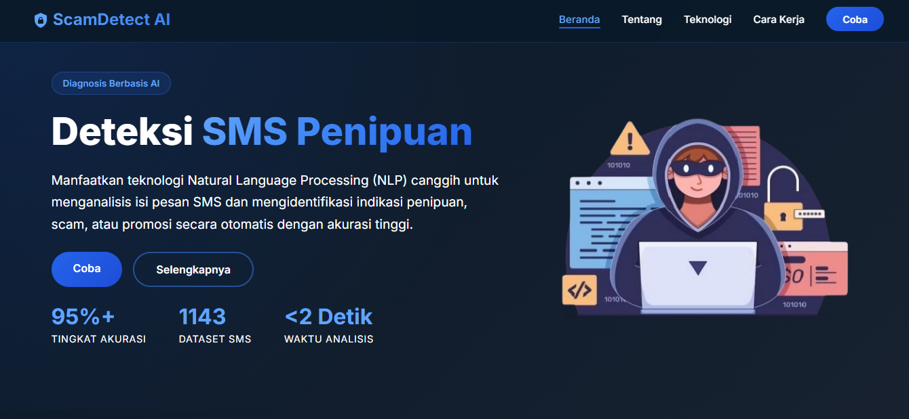
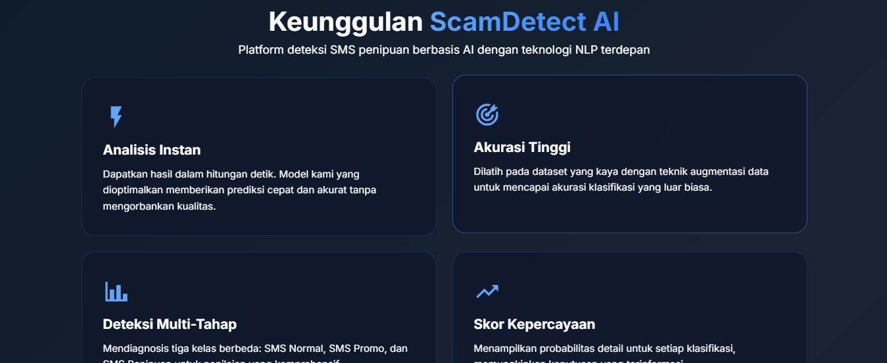
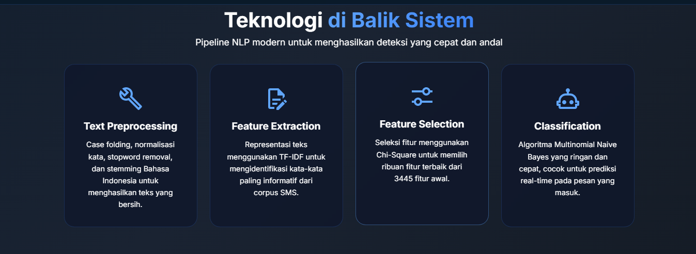
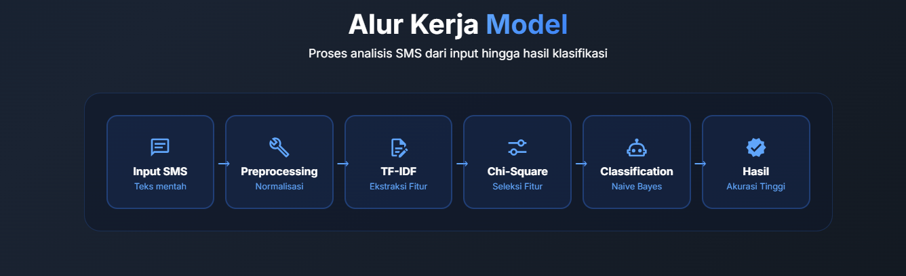
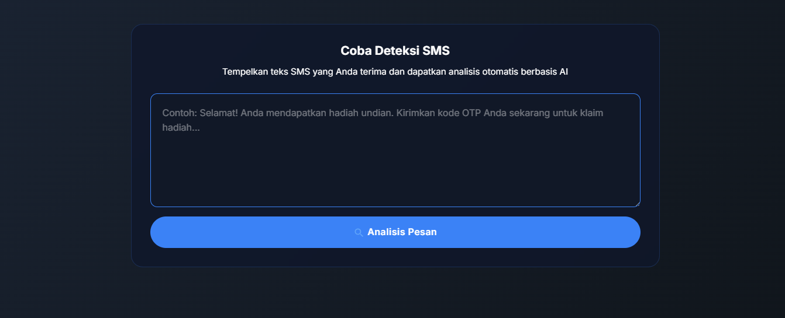

#  ScamDetect AI — Deteksi SMS Penipuan Berbasis AI

Platform web untuk mendeteksi SMS penipuan (scam), promosi, dan pesan normal secara otomatis menggunakan teknologi **Natural Language Processing (NLP)** dan algoritma **Multinomial Naive Bayes**.

##  Deskripsi

ScamDetect AI menganalisis isi pesan SMS dan mengklasifikasikannya ke dalam tiga kategori:

| Kode | Kategori | Keterangan |
|------|----------|------------|
| 0 | **Pesan Aman** | Tidak terdeteksi indikasi penipuan |
| 1 | **Pesan Penipuan/Scam** | Berpotensi penipuan — jangan balas, klik tautan, atau bagikan OTP |
| 2 | **Pesan Promo** | Terdeteksi sebagai promosi — pastikan dari pengirim resmi |

##  Fitur Utama

- **Analisis Instan** — Hasil prediksi dalam hitungan detik
- **Akurasi Tinggi** — Dilatih pada 1.143 dataset SMS Bahasa Indonesia
- **Antarmuka Modern** — Desain responsif yang bisa diakses dari perangkat apa pun
- **Privasi Terjaga** — Data SMS tidak disimpan secara permanen

##  Tampilan Aplikasi











##  Teknologi yang Digunakan

### Backend
- **Python 3** & **Flask** — Web framework
- **Scikit-learn** — Multinomial Naive Bayes & TF-IDF Vectorizer
- **NLTK** — Stopword removal (Bahasa Indonesia)
- **Sastrawi** — Stemmer Bahasa Indonesia
- **Pandas** — Pengolahan data

### Frontend
- **HTML5**, **CSS3**, **JavaScript**
- **Google Fonts (Inter)** — Tipografi modern
- **Iconify** — Ikon vektor

##  Alur Kerja Model

```
Input SMS → Preprocessing → TF-IDF → Chi-Square → Naive Bayes → Hasil Klasifikasi
```

### Pipeline Preprocessing
1. **Case Folding** — Mengubah teks ke huruf kecil, menghapus URL & karakter khusus
2. **Normalisasi Kata** — Mengubah singkatan ke bentuk lengkap (`yg` → `yang`, `gk` → `tidak`, dll.)
3. **Stopword Removal** — Menghapus kata-kata yang tidak informatif
4. **Stemming** — Mengubah kata ke bentuk dasar menggunakan Sastrawi

##  Cara Menjalankan

### 1. Clone Repository

```bash
git clone https://github.com/Lulyar/ScamDetection.git
cd ScamDetection
```

### 2. Buat Virtual Environment

```bash
python -m venv venv
venv\Scripts\activate        # Windows
# source venv/bin/activate   # macOS/Linux
```

### 3. Install Dependensi

```bash
pip install flask pandas scikit-learn nltk Sastrawi
```

### 4. Download NLTK Stopwords

```python
import nltk
nltk.download('stopwords')
```

### 5. Jalankan Aplikasi

```bash
python app.py
```

Aplikasi akan berjalan di `http://localhost:5000`

##  Struktur Proyek

```
ScamDetection/
├── app.py                          # Aplikasi Flask utama
├── templates/
│   └── index.html                  # Halaman antarmuka pengguna
├── static/
│   ├── style.css                   # Stylesheet
│   ├── script.js                   # Logika frontend
│   └── gambar_scam.png             # Ilustrasi hero
├── nlp.ipynb                       # Notebook eksplorasi & pelatihan model
├── dataset_sms_spam_v1.csv         # Dataset mentah SMS
├── clean_data.csv                  # Dataset setelah preprocessing
├── key_norm.csv                    # Kamus normalisasi singkatan
├── model_deteksi_pesan.sav         # Model Naive Bayes (tersimpan)
├── feature_tf-idf.sav             # Vocabulary TF-IDF
├── new_selected_feature_tf-idf.sav # Vocabulary setelah seleksi fitur
├── .gitignore
└── README.md
```

> **Catatan:** File `.sav`, `.pkl`, `.h5`, dan `.csv` tidak disertakan di repository karena ukurannya yang besar. Jalankan notebook `nlp.ipynb` untuk membuat ulang model dan dataset.

- GitHub: [@Lulyar](https://github.com/Lulyar)
- Instagram: [@luly_agrmdhn](https://www.instagram.com/luly_agrmdhn)
- LinkedIn: [Luly Angga Ramadhan](https://www.linkedin.com/in/luly-angga-ramadhan-b558aa355)

